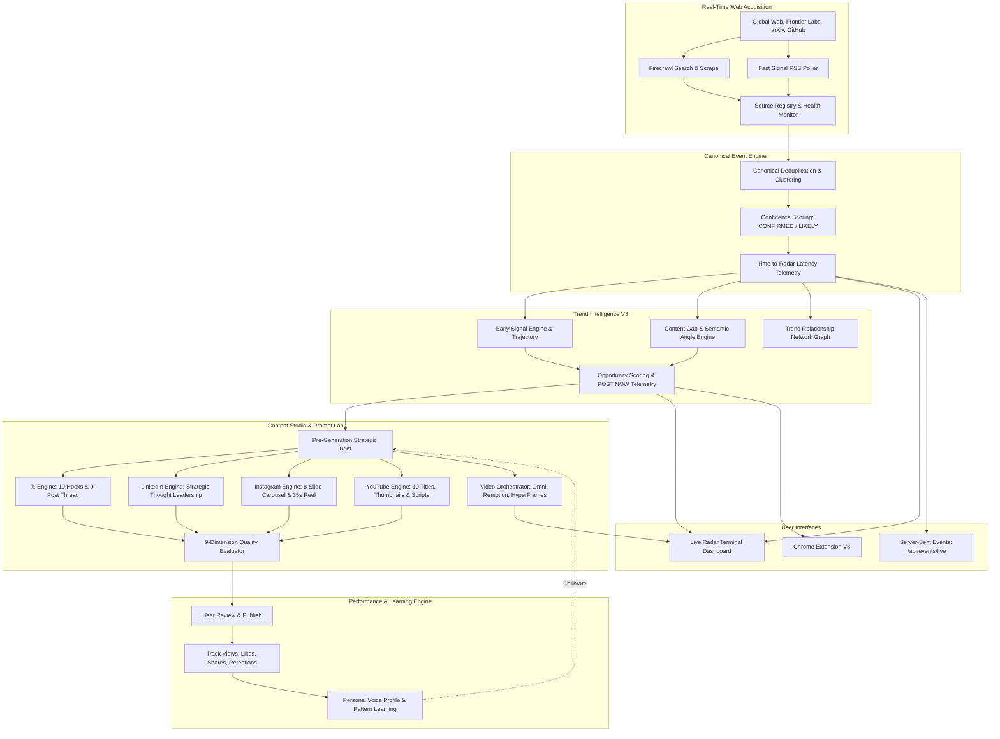

# ⚡ AI VIRAL RADAR V3

## REAL-TIME GLOBAL AI INTELLIGENCE + CONTENT OPERATING SYSTEM

> **"Discover breaking AI developments in real-time, verify events across multi-source signals with Firecrawl, pinpoint underserved content gaps, and turn verified intelligence into original, high-retention multi-platform social posts and production-grade video prompts."**

AI Viral Radar V3 transforms AI content creation from a reactive dashboard into an authoritative, professional **Intelligence Terminal and Operating System**.

---

## 🚀 Key Highlights & Philosophy

- **Probabilistic Scoring Over False Promises**: Never claims "guaranteed virality". Operates strictly on scientific probabilities: *Opportunity Score, Distribution Potential, Hook Strength, Early Signal Explosion Probability, and Content Gap*.
- **Firecrawl Primary Web Acquisition Layer**: Ingestion, web search, GitHub discovery, research preprints, and verification flow cleanly through `WebAcquisitionProvider`. Brittle custom scrapers have been completely eliminated.
- **Google Gemini Primary AI Intelligence**: Powered by Google Gemini (`gemini-2.5-flash` via the official `google.genai` SDK) for pre-generation editorial briefs, multi-platform adaptation, and cinematic prompt compilation.
- **Canonical Event Engine**: Automatically clusters multiple articles from OpenAI, Reuters, TechCrunch, arXiv, and X into a single deduplicated canonical event with multi-source verification (`CONFIRMED`, `LIKELY`, `DEVELOPING`, `UNVERIFIED`).
- **Live Radar Terminal**: Real-time streaming dashboard with **Server-Sent Events (SSE)**, latency telemetry ("Time to Radar"), live ingestion metrics, and breaking alert banners.
- **11-Category Global AI News Center**: Dedicated intelligence center covering AI Models, Companies, Agents, Coding, Video, Image, Robotics, Research, Business, Hardware, and Policy.
- **Multi-Platform Content Studio**: Synthesizes platform-native copy for **𝕏** (10-hook evaluator + 9-post threads), **LinkedIn** (executive thought leadership), **Instagram** (8-slide carousels + 35s Reels), and **YouTube** (10 titles, 3 thumbnails, cold opens, scripts).
- **Video Orchestrator & Prompt Lab**: Production-ready compilers for **Gemini Omni** (20-field cinematic prompt payload), **Remotion** (programmatic React charts & captions), and **HyperFrames** (deterministic HTML5 + paused GSAP timelines).
- **Personal Learning Loop**: Calibrates against user voice samples and logs performance telemetry to continuously update `PersonalContentProfile`.
- **Chrome Extension V3**: 4 dedicated tabs (`⚡ LIVE`, `📈 TRENDS`, `🎯 OPPS`, `✍ CREATE`) with an in-page 𝕏 assistant widget.

---

## 🏛 System Architecture



---

## 📂 Project Structure

```text
ViralConetntCreator/
├── apps/
│   └── web/                                # React 18 / Vite / TypeScript Intelligence Terminal
│       ├── src/
│       │   ├── components/                 # LiveRadarView, GlobalNewsCenter, ContentStudioV3,
│       │   │                               # PromptLabModal, TrendNetworkGraph, TerminalStatusBar, etc.
│       │   ├── lib/api.ts                  # Typed V3 API Client
│       │   ├── types.ts                    # V3 Domain Models
│       │   └── App.tsx                     # Main Layout & Navigation
│       └── package.json
├── extension/                              # Chrome Manifest V3 Extension
│   ├── manifest.json
│   ├── icons/                              # Extension icons (16, 48, 128px)
│   └── src/
│       ├── popup/popup.html & popup.js     # 4 Tabs: LIVE, TRENDS, OPPS, CREATE
│       └── content/content.js              # In-Page 𝕏 Assistant Widget
├── backend/                                # Python FastAPI Service
│   ├── main.py                             # Lifespan, CORS & App initialization
│   ├── api/v1.py                           # REST & SSE Endpoints (/events, /news, /content, etc.)
│   ├── db/
│   │   ├── session.py                      # Async SQLAlchemy engine
│   │   └── models.py                       # V3 ORM Models (Event, EventSource, ContentBrief, etc.)
│   ├── providers/
│   │   ├── web_acquisition.py              # Centralized Firecrawl Acquisition Provider
│   │   ├── source_registry.py              # Configurable Source Registry & Health
│   │   ├── rss_poller.py                   # Fast Signal RSS Poller
│   │   └── gemini_provider.py              # Google Gemini AI Provider (google.genai SDK)
│   ├── services/
│   │   ├── events/event_engine.py          # Canonical Event Engine & Clustering
│   │   ├── trends/                         # EarlySignalEngine, ContentGapEngine, TrendGraph
│   │   ├── content/content_factory.py      # Multi-Platform Content Studio & 9-Dimension Quality
│   │   ├── video/video_orchestrator.py     # Gemini Omni, Remotion & HyperFrames Prompt Lab
│   │   ├── learning/learning_engine.py     # Social Telemetry & My Voice Calibrator
│   │   └── workflow/workflow_service.py    # Daily Briefing, Plan My Day & Content Queue
├── tests/                                  # Comprehensive Test Suite (40/40 Passing Tests)
│   ├── test_v3_e2e_pipeline.py             # Full Simulated Discovery-to-Video Pipeline
│   ├── test_v3_core.py                     # Source Registry, Event Engine, Factory, Video Compilers
│   ├── test_trend_intelligence.py          # Acceleration, Lifecycle, Angle Decomposition
│   ├── test_firecrawl_provider.py          # Query Rotation, Normalization, Fallbacks
│   ├── test_gemini_provider.py             # Structured Output, Prompt Injection Defenses
│   ├── test_similarity.py                  # Anti-Copy & RapidFuzz Similarity
│   └── test_virality_scorer.py             # Logarithmic Engagement & Freshness Decay
└── docs/                                   # Complete Technical Documentation
    ├── ARCHITECTURE.md                     # System Topology & Principles
    ├── DATA_MODEL.md                       # Database Tables & Relationships
    ├── DISCOVERY_ENGINE.md                 # Web Acquisition & Source Registry
    ├── EVENT_ENGINE.md                     # Canonical Deduplication & Latency KPIs
    ├── TREND_ENGINE.md                     # Early Signals & Content Gaps
    ├── CONTENT_ENGINE.md                   # Multi-Platform Studio & Hook Evaluator
    ├── VIDEO_ENGINE.md                     # Video Orchestrator & Prompt Compilers
    ├── API.md                              # REST & Server-Sent Events Specification
    ├── DEPLOYMENT.md                       # Production Deployment Guide
    ├── ENVIRONMENT.md                      # Environment Variables Reference
    ├── TESTING.md                          # Automated Test Suite Guide
    └── OPEN_SOURCE_RESOURCES.md            # Curated Reference Libraries & Conceptual Borrowings
```

---

## ⚡ Getting Started

### 1. Environment Setup

Copy `.env.example` or create `.env` in the repository root:
```ini
APP_ENV=development
FIRECRAWL_API_KEY=fc-xxxxxxxxxxxxxxxxxxxx
GEMINI_API_KEY=AIzaxxxxxxxxxxxxxxxxxxxx
GEMINI_MODEL=gemini-2.5-flash
DATABASE_URL=sqlite+aiosqlite:///./viral_radar.db
```

### 2. Run Automated Verification Tests
```bash
python -m pytest tests/ -v
```
*Expected result: **40 passed** with zero errors.*

### 3. Start Backend Service
```bash
python -m uvicorn backend.main:app --host 0.0.0.0 --port 8000 --reload
```
- API Swagger Documentation: `http://localhost:8000/docs`
- Live SSE Event Stream: `http://localhost:8000/api/events/live`

### 4. Start Frontend Terminal Dashboard
```bash
cd apps/web
npm install
npm run dev -- --port 5173
```
- Open browser at `http://localhost:5173` to access the **Live Radar Terminal**.

---

## 🛡 Security & Ethics

1. **Prompt Injection Defense**: All untrusted web content is sandboxed within `<source_content>` delimiters with strict system security directives.
2. **Zero Fabricated Metrics**: If social metrics are absent, the system displays `Predicted Interest` and `Viral Potential` rather than inventing false numbers.
3. **No Autonomous Publishing**: Prepares ready-to-publish content for explicit human review, copying, or export.
