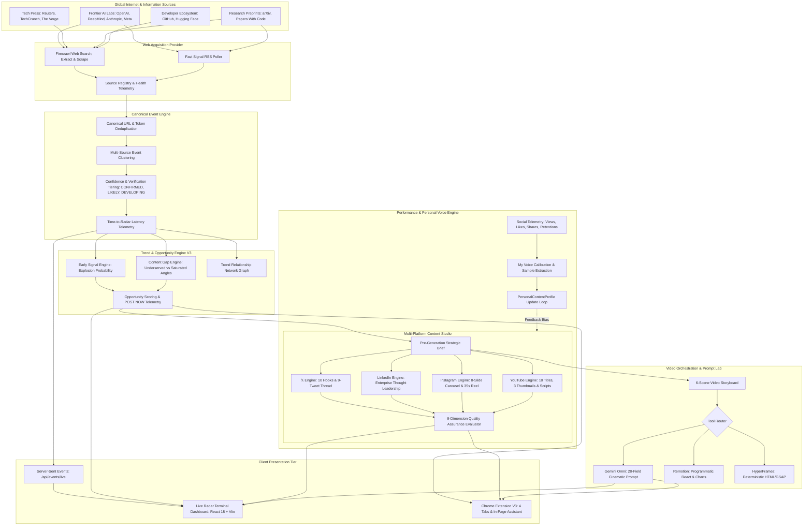

# AI Viral Radar V3 — System Architecture

AI Viral Radar V3 is a **Real-Time Global AI Intelligence & Content Operating System** that continuously monitors frontier AI developments, clusters multi-source articles into verified canonical events, identifies high-leverage content gaps, synthesizes platform-native social content, compiles production-ready video prompts, and learns iteratively from audience performance feedback.

---

## 1. Global End-to-End System Topology

---

## 2. Core Operational Pillars

### 1. Probability Over False Guarantees
The system **never** claims "guaranteed virality". It operates entirely on probabilistic scoring:
- **Opportunity Score** ($0 - 100$)
- **Distribution Potential**
- **Hook Strength** ($0 - 100$)
- **Explosion Probability** ($0 - 100\%$)
- **Content Gap Score**

### 2. Centralized Firecrawl Acquisition
All external web discovery, research scraping, and verification flows strictly through `WebAcquisitionProvider`. Brittle custom scrapers and headless browser sessions are completely eliminated for acquisition.

### 3. Google Gemini Primary Intelligence
Gemini 2.5 Flash powers strategic editorial briefs, 10-hook generation, thread composition, multi-platform adaptation, and 20-field cinematic video prompts. All external input is treated as untrusted and wrapped in safety fences to prevent prompt injection.

### 4. Tri-Engine Video Routing
- **Gemini Omni**: Photorealistic neural visuals, B-roll, continuous camera motion.
- **Remotion**: Programmatic benchmark charts, code terminals, animated captions.
- **HyperFrames**: HTML5/CSS3 dynamic cards, telemetry badges, frame-accurate paused GSAP animations.

### 5. Learning Loop
Actual performance metrics (impressions, retention, engagement rates) feed back into `PersonalContentProfile`, updating winning hook patterns and informing future angle recommendations.
