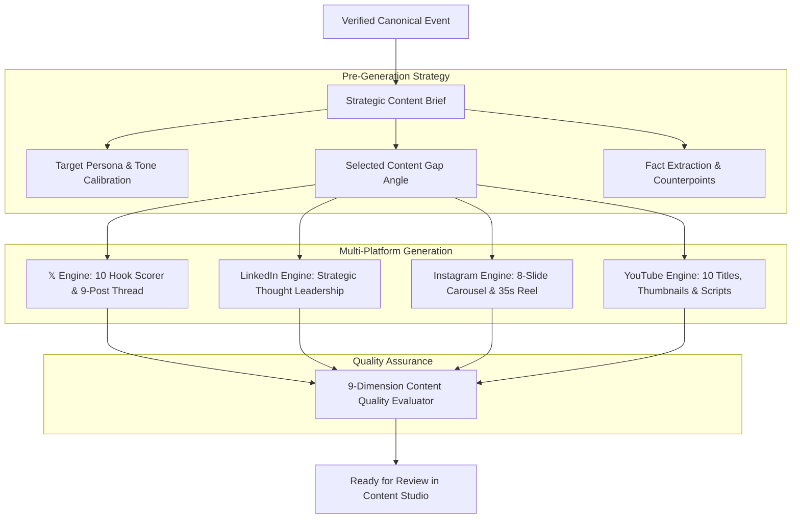

# AI Viral Radar V3 — Multi-Platform Content Studio & Strategist

The **Content Engine** (`backend/services/content/content_factory.py`) turns verified canonical events into platform-native, high-retention content for 𝕏, LinkedIn, Instagram, and YouTube.

---

## 1. Content Generation Pipeline

---

## 2. Pre-Generation Content Brief (`ContentBriefData`)

Before a single post is generated, Gemini compiles an editorial brief:
- `topic`: Canonical event title
- `audience`: Primary target developer / enterprise persona
- `angle`: Differentiated content gap angle (e.g., developer workflow)
- `hook_strategy`: Chosen hook archetype (Curiosity, Contrarian, Builder Insight, etc.)
- `key_claims`: Verified factual statements extracted from primary sources
- `counterpoint`: Critical nuance, limitation, or caveat to prevent blind hype
- `cta_strategy`: Context-specific call to action (Discussion, Save, Soft Follow)

---

## 3. 𝕏 Hook Engine & Thread Architecture

The Hook Engine generates 10 candidate hooks across 10 psychological archetypes:
1. *Curiosity Loop*
2. *Contrarian Stance*
3. *Breaking News Fast Drop*
4. *Unexpected Technical Insight*
5. *Strong Analytical Claim*
6. *Direct Question*
7. *6-Month Prediction*
8. *Data & Benchmark Breakdown*
9. *Builder / Practitioner Perspective*
10. *Personal Architectural Observation*

Each hook is scored across:
- Curiosity Score
- Specificity Score
- Novelty Score
- Clarity Score
- Scroll-Stop Potential
- Credibility & Evidence

---

## 4. Platform Specifications

| Platform | Format | Structure & Tone |
| :--- | :--- | :--- |
| **𝕏 (Twitter)** | Single Post + 9-Tweet Thread | Short sentences, high density, counterpoints, zero hashtags in main hook, attribution link. |
| **LinkedIn** | Long-form Post | Professional framing, enterprise margin implications, architecture shift, open conversation CTA. |
| **Instagram** | 8-Slide Carousel + 35s Reel | Visual layout per slide, pattern break at 0-2s, value delivery at 12-25s, payoff, clear bookmark CTA. |
| **YouTube** | 10 Titles, 3 Thumbnails, Short & Long Script | High-curiosity titles, minimal-text high-contrast thumbnails, cold open, B-roll directions, chapters. |

---

## 5. 9-Dimension Quality Check

Every generated draft must pass an automated 9-point evaluation:
1. `fact_check_score` ($\ge 85$)
2. `originality_score` ($\ge 80$)
3. `hook_strength_score` ($\ge 80$)
4. `clarity_score` ($\ge 80$)
5. `platform_fit_score` ($\ge 85$)
6. `audience_fit_score` ($\ge 85$)
7. `cta_strength_score` ($\ge 75$)
8. `anti_spam_score` ($\ge 90$)
9. `anti_clickbait_score` ($\ge 85$)
