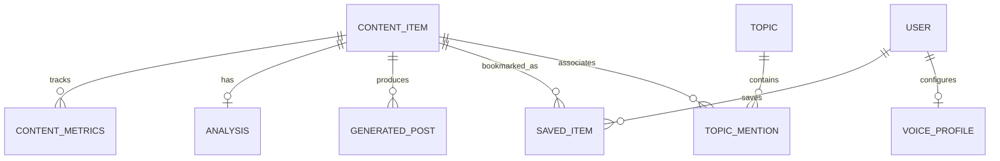

# AI Viral Radar — Data Model & Schema Specification

## 1. Normalized Content Model

Every content item ingested across RSS feeds, GitHub repositories, Reddit communities, Hacker News, X syndication, or realistic mock providers is normalized into a unified structure before storage:

| Field | Type | Description |
| :--- | :--- | :--- |
| `id` | UUID (string) | Universal unique identifier |
| `source` | string (index) | Provider name (e.g. OpenAI, DeepMind, GitHub, Hacker News) |
| `source_type` | enum/string | `rss`, `x`, `github`, `reddit`, `news`, `demo` |
| `title` | string | Headline or first 100 characters of post |
| `content` | text | Full post body, summary, or paper abstract |
| `url` | string (unique, index) | Canonical URL of original source |
| `author` | string | Display name of author or organization |
| `author_handle` | string | Social handle (e.g. `@sama`, `deepseek-ai`) |
| `author_url` | string | Author profile link |
| `published_at` | datetime (index) | Timestamp when item was published |
| `collected_at` | datetime | Timestamp when radar ingested item |
| `views` | integer | Total view/impression count |
| `likes` | integer | Like / upvote count |
| `reposts` | integer | Retweet / share / fork count |
| `replies` | integer | Comment count |
| `quotes` | integer | Quote retweet count |
| `media` | JSON array | List of attached image/video URLs |
| `hashtags` | JSON array | List of discovered hashtags |
| `language` | string | ISO language code (`en`) |
| `engagement_rate`| float | Computed interaction percentage |
| `engagement_velocity` | float | Hourly velocity vs expected baseline (+340%) |
| `viral_score` | float (index) | Normalized score between 0.0 and 100.0 |
| `trend_score` | float | Topic clustering trend weight |
| `topic` | string (index) | Category: Models, Agents, Research, etc. |
| `entities` | JSON array | Extracted named entities |
| `sentiment` | string | `positive`, `neutral`, `contrarian` |
| `content_type` | string | `news`, `benchmark`, `release`, `tool`, `paper` |
| `hook_type` | string | `curiosity`, `milestone`, `contrarian`, `breaking_news` |
| `source_urls` | JSON array | Preserved attribution links |
| `attribution_required` | boolean | True for all transformed content |

---

## 2. Database Schema (SQLAlchemy ORM)

### Table: `content_items`
Primary store for all discovered intelligence.
- **Composite Indexes**:
  - `idx_viral_published (viral_score, published_at)`: Enables instant feed sorting by virality.
  - `idx_source_topic (source, topic)`: Optimizes category and publication filtering.

### Table: `analyses`
One-to-one association with `content_items`. Caches AI cognitive extraction:
- `summary`: Executive summary.
- `main_claim`: Primary breakthrough claim.
- `why_viral`: Array of bulleted sociological/technical drivers.
- `hook_type`: Cognitive trigger classification.
- `key_facts`: Array of verified technical data points.
- `important_entities`: Organizations, models, hardware mentioned.
- `audience`: Intended recipient demographic.
- `recommended_angle`: Strategic creator angle.

### Table: `generated_posts`
One-to-many relationship with `content_items`. Stores synthesized variants:
- `variant_type`: `news`, `hot_take`, `educational`, `thread`, `question`.
- `tone`: `professional`, `technical`, `bold`, `casual`, `minimal`.
- `length`: `short`, `medium`, `long`.
- `content`: Primary post text.
- `thread_items`: Array of numbered sub-posts for thread format.
- `similarity_score`: Token overlap with source (0.0 to 1.0).
- `is_safe`: Boolean (true if similarity < threshold).
- `attribution_included`: Enforces source link presence.

### Table: `saved_items`
User editorial workflow:
- `status`: `Idea`, `Draft`, `Posted`, `Ignored`.
- `notes`: User commentary and scheduling reminders.
- `saved_at`: Bookmark timestamp.

### Table: `voice_profiles`
Personal tone and style calibration:
- `tone_preference`: Baseline voice.
- `voice_examples`: Array of user-authored authentic posts.
- `guidelines`: Custom constraints (e.g. "No emojis, prioritize architecture over hype").
