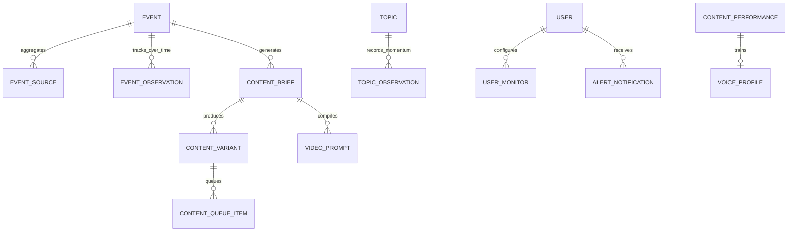

# AI Viral Radar V3 — Data Model & Schema Specification

This document defines the database schema and entity relationships for **AI Viral Radar V3**, extending the V2 foundation into a multi-source canonical event and video prompt orchestration system.

---

## 1. V3 Entity Relationship Diagram (ERD)

---

## 2. Core V3 Tables

### Table: `events`
Primary canonical event store created by clustering multi-source items.
- `id`: UUID (Primary Key)
- `canonical_title`: Normalized, deduplicated headline
- `summary`: Synthesized factual overview
- `category`: Primary AI domain (Models, Agents, Video, Research, etc.)
- `status`: `CONFIRMED`, `LIKELY`, `DEVELOPING`, `UNVERIFIED`, `CONTRADICTED`
- `confidence_score`: Multi-source corroboration score ($0.0 - 100.0$)
- `source_count`: Total articles/mentions clustered
- `independent_source_count`: Number of distinct publisher domains
- `has_tier1_source`: Boolean indicating presence of official lab or Tier 1 outlet
- `primary_source_url`: Canonical authoritative release link
- `key_facts`: JSON array of verified technical assertions
- `entities`: JSON array of extracted organizations, models, and benchmarks
- `recommended_angle`: Selected underserved content gap angle
- `recommended_platform`: Optimal publication channel (`X`, `LinkedIn`, `YouTube`, etc.)
- `momentum_score`: Aggregate momentum ($0.0 - 100.0$)
- `competition_score`: Creator saturation index ($0.0 - 100.0$)
- `opportunity_score`: Actionable opportunity score ($0.0 - 100.0$)
- `detection_latency`: Seconds from publication to discovery
- `verification_latency`: Seconds to multi-source verification
- `analysis_latency`: Seconds to complete strategic brief
- `total_pipeline_latency`: Total seconds ("Time to Radar")
- `event_timestamp`: Source publication time
- `first_seen_at`: Ingestion detection time

### Table: `event_sources`
Individual publisher articles mapped to a canonical event.
- `id`: UUID
- `event_id`: Foreign key to `events.id`
- `url`: Article canonical URL
- `title`: Article headline
- `source_name`: Publisher (e.g. OpenAI, Reuters, TechCrunch)
- `source_type`: `official`, `news`, `research`, `community`
- `source_quality`: `Tier 1`, `Tier 2`, `Tier 3`
- `published_at`: Item publication timestamp
- `snippet`: Content excerpt

### Table: `event_observations`
Time-series tracking of event momentum, velocity, and mentions over time.
- `id`: UUID
- `event_id`: Foreign key to `events.id`
- `timestamp`: Observation recorded time
- `mentions`: Cumulative mention count
- `momentum`: Instantaneous momentum score
- `velocity`: Mentions per hour
- `confidence_score`: Corroboration score at observation time

### Table: `content_briefs`
Pre-generation editorial briefs generated before final copy synthesis.
- `id`: UUID
- `event_id`: Optional foreign key to `events.id`
- `topic`: Event or trend headline
- `audience`: Calibrated demographic (Developers, Enterprise, etc.)
- `angle`: Differentiated perspective
- `hook_strategy`: Psychological hook trigger
- `key_claims`: JSON array of verified claims
- `counterpoint`: Critical limitation or nuance
- `visual_strategy`: Visual / video direction
- `platform_strategy`: Primary and secondary distribution recommendation

### Table: `content_variants`
Generated platform-native content items across 𝕏, LinkedIn, Instagram, and YouTube.
- `id`: UUID
- `brief_id`: Foreign key to `content_briefs.id`
- `platform`: `x`, `linkedin`, `instagram`, `youtube`
- `format`: `single_post`, `thread`, `carousel`, `reel`, `video_script`
- `hook`: Selected opening hook text
- `content`: Primary copy body
- `structured_payload`: JSON containing slides, timestamps, thumbnail prompts, etc.
- `quality_score`: 9-dimension quality rating ($0.0 - 100.0$)
- `is_approved`: Editorial approval flag

### Table: `video_prompts`
Compiled production-ready prompts for video generation tools.
- `id`: UUID
- `brief_id`: Optional foreign key to `content_briefs.id`
- `engine`: `gemini_omni`, `remotion`, `hyperframes`, `storyboard`
- `prompt_payload`: JSON structured according to engine specification
- `master_prompt_text`: Raw compiled prompt for immediate copy-pasting

### Table: `user_monitors`
Custom user monitoring rules for topics, repositories, and domains.
- `id`: UUID
- `name`: Monitor title (e.g., "Monitor OpenAI Releases")
- `query`: Keyword or domain filter
- `frequency`: Polling interval in seconds
- `importance_threshold`: Minimum opportunity score to trigger alert

### Table: `content_queue_items`
Editorial production queue state machine.
- `id`: UUID
- `variant_id`: Foreign key to `content_variants.id`
- `status`: `IDEA`, `DRAFT`, `REVIEW`, `APPROVED`, `READY`, `SCHEDULED`, `PUBLISHED`, `PERFORMING`, `COMPLETED`
- `priority`: `URGENT`, `HIGH`, `MEDIUM`, `LOW`
- `scheduled_at`: Configured publishing time
