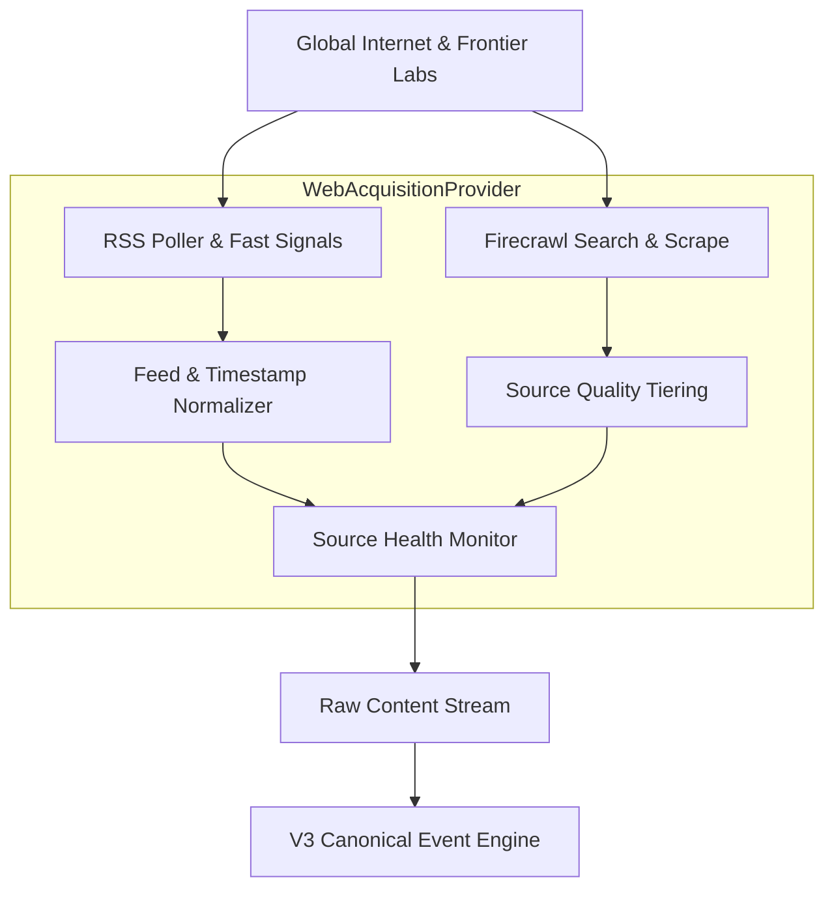

# AI Viral Radar V3 — Discovery Engine & Web Acquisition Layer

The **Discovery Engine** is the real-time perceptual layer of AI Viral Radar V3. It continuously monitors the global internet for breaking frontier model releases, open-source weights, technical research papers, developer tooling, and enterprise AI shifts.

---

## 1. Web Acquisition Architecture

All external web acquisition flows strictly through `WebAcquisitionProvider` using Firecrawl search, extraction, and scrape APIs. No ad-hoc, brittle scraping scripts or headless browsers are used for general acquisition.

---

## 2. Seeded Source Registry

Sources are classified into 4 functional tiers with dedicated polling targets and reliability scoring:

| Source Name | Type | Quality Tier | Topics / Domains | Freshness Target |
| :--- | :--- | :--- | :--- | :--- |
| **OpenAI Blog & Research** | Official | Tier 1 | Models, Reasoning, Agents | 5m |
| **Google DeepMind & AI** | Official | Tier 1 | Gemini, Multimodal, Hardware | 5m |
| **Anthropic Research** | Official | Tier 1 | Claude, Alignment, Computer-Use | 5m |
| **Meta AI** | Official | Tier 1 | Llama, Open Weights, PyTorch | 10m |
| **NVIDIA Newsroom** | Official | Tier 1 | Blackwell, CUDA, Inference Chips | 10m |
| **xAI Announcements** | Official | Tier 1 | Grok, Reasoning, Datacenters | 10m |
| **Hugging Face Hub** | Official / Hub | Tier 1 | Open Models, Quantization, Papers | 5m |
| **DeepSeek AI** | Official | Tier 1 | Reasoning, MoE, V3 Architectures | 10m |
| **arXiv cs.AI / cs.CL** | Research | Tier 1 | Preprints, Benchmarks, Architectures | 15m |
| **Papers With Code** | Research | Tier 1 | SOTA Leaderboards, Evaluations | 30m |
| **Reuters Tech** | News | Tier 2 | Policy, Business, Enterprise Deals | 15m |
| **TechCrunch / The Verge** | News | Tier 2 | Product Launches, Startup Funding | 15m |
| **Hacker News & 𝕏 Signals** | Community | Tier 3 | Developer Reactions, GitHub Drops | 5m |

> [!NOTE]
> Community signals from Hacker News and 𝕏 are strictly treated as **discovery triggers**, never as primary ground truth. A community discovery must be corroborated by Tier 1/2 sources before receiving `CONFIRMED` status.

---

## 3. Query Rotation & Freshness Filters

Firecrawl discovery employs dynamic query rotation across 11 key operational domains:
1. `site:openai.com/index OR site:deepmind.google/discover "model" OR "weights"`
2. `site:anthropic.com/news OR site:huggingface.co/blog "release"`
3. `"arXiv" "large language model" OR "reasoning" OR "multimodal" 2026`
4. `"SWE-bench" OR "benchmark" "state of the art" OR "frontier"`
5. `site:techcrunch.com/category/artificial-intelligence "funding" OR "acquisition"`
6. `site:github.com trending "agents" OR "MCP" OR "vLLM"`

---

## 4. Source Health & Telemetry

Each registered source maintains rolling telemetry:
- `status`: `healthy`, `degraded`, or `offline`
- `last_checked_at`: Timestamp of latest polling cycle
- `consecutive_failures`: Failure counter triggering exponential backoff
- `average_latency_ms`: Response latency tracking for API observability
