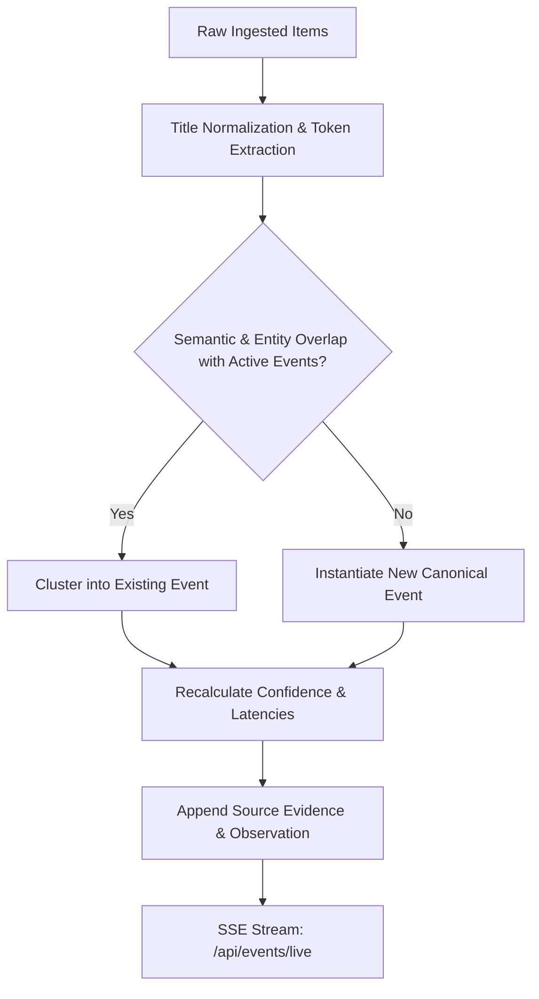

# AI Viral Radar V3 — Event Engine

The **Event Engine** (`backend/services/events/event_engine.py`) transforms fragmented, noisy articles and social signals into deduplicated, verified **Canonical Events**.

Instead of treating 10 articles from OpenAI, Reuters, TechCrunch, and arXiv as 10 separate stories, the Event Engine clusters them into a single canonical event entity:
> `EVENT: OpenAI Launches GPT-5 Orion with Autonomous Tool Loops`

---

## 1. Event Clustering Pipeline

---

## 2. Canonical Deduplication Criteria

Two items belong to the same canonical event if:
1. **URL Match**: Normalized canonical URLs or redirect targets match.
2. **Title Jaccard Token Overlap**: Token overlap excluding common stopwords exceeds 40%.
3. **Named Entity Match**: Shared major entity pairs (e.g., `("OpenAI", "Orion")`, `("DeepSeek", "V3")`).
4. **Publication Window**: Published within 48 hours of each other.

---

## 3. Event Verification & Confidence Model

Every event is assigned an objective confidence tier based on multi-source confirmation:

| Status Tier | Definition | Requirement |
| :--- | :--- | :--- |
| **`CONFIRMED`** | Indisputable, verified event | Official primary source release OR $\ge 2$ independent Tier 1/2 news/research sources. |
| **`LIKELY`** | High probability development | $\ge 2$ independent sources with consistent reporting and zero direct contradictions. |
| **`DEVELOPING`** | Emerging story under observation | Single reputable source reporting; cross-checks pending. |
| **`UNVERIFIED`** | Unsubstantiated rumor or leak | Community posts or unvetted forum discussions without official corroboration. |
| **`CONTRADICTED`** | Disputed or debunked claim | Official correction or conflicting reports between tier-1 authorities. |

---

## 4. Pipeline Latency Telemetry ("Time to Radar")

To ensure speed and freshness, the Event Engine records precision timestamps across every stage:

```mermaid
gantt
    title Event Lifecycle Timestamps & Latency Tracking
    dateFormat X
    axisFormat %s sec
    section Pipeline
    First Seen        :0, 1
    Detection Latency :1, 12
    Verification Latency :12, 18
    Analysis Latency  :18, 31
    Surfaced to Radar :milestone, 31, 0
```

- **`detection_latency`**: Elapsed time from source publication to initial discovery.
- **`verification_latency`**: Time from discovery to multi-source confirmation.
- **`analysis_latency`**: Duration of Gemini strategic analysis and brief synthesis.
- **`total_pipeline_latency`**: Total time from publication to appearance on the Live Radar terminal (**Target: $< 60$ seconds**).
