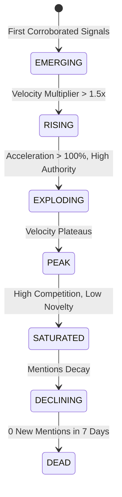

# AI Viral Radar V3 — Trend Intelligence & Early Signal Engine

The **Trend Engine V3** (`backend/services/trends/`) identifies rising narratives before they peak, computes momentum and saturation curves, discovers underserved conversation gaps, and models trend relationships.

---

## 1. Lifecycle Progression

---

## 2. Early Signal Scoring (`EarlySignalScore`)

The **Early Signal Engine** (`backend/services/trends/early_signal.py`) surfaces breakout topics when mainstream competition is still low:

$$\text{Explosion Probability} = 0.30 \cdot M + 0.25 \cdot A + 0.20 \cdot N + 0.15 \cdot (100 - C) + 0.10 \cdot D$$

Where:
- $M$: Current momentum score ($0 - 100$)
- $A$: Mention acceleration percentage over prior baseline
- $N$: Topic novelty score ($0 - 100$)
- $C$: Existing creator competition score ($0 - 100$)
- $D$: Source diversity / authority tier weight

If `explosion_probability >= 75.0` and competition is $< 50$, the system triggers an **EARLY SIGNAL ALERT** on the Live Radar terminal with recommended trajectory `EXPLODING`.

---

## 3. Content Gap Engine (`content_gap.py`)

A high-momentum trend is useless if everyone is repeating the exact same take. The Content Gap Engine performs semantic angle decomposition across 10 angles:

| Angle Dimension | Example for "Frontier Model Launch" | Saturation Level |
| :--- | :--- | :--- |
| **Headline Benchmark** | "Model X scores 92% on SWE-bench!" | Overused (95% saturated) |
| **Philosophical / Hype** | "Is this AGI?" | Overused (90% saturated) |
| **Developer Workflow** | "How to swap existing LangChain/LlamaIndex agents" | **Underused (Content Gap: HIGH)** |
| **Inference Cost Curve** | "Token pricing per million vs self-hosting Ollama" | **Underused (Content Gap: HIGH)** |
| **Edge Cases & Failure Modes**| "Context degradation over 100k tokens" | **Underused (Content Gap: HIGH)** |
| **Enterprise Defensibility** | "Why model wrappers will die in Q4" | Moderate |

---

## 4. Trend Relationship Network Graph (`trend_graph.py`)

The system automatically extracts co-occurring technical entities (e.g., `["OpenAI", "Orion", "SWE-bench", "Tool Use", "Agents"]`) and compiles an interactive force-directed graph with node importance and edge weights.
