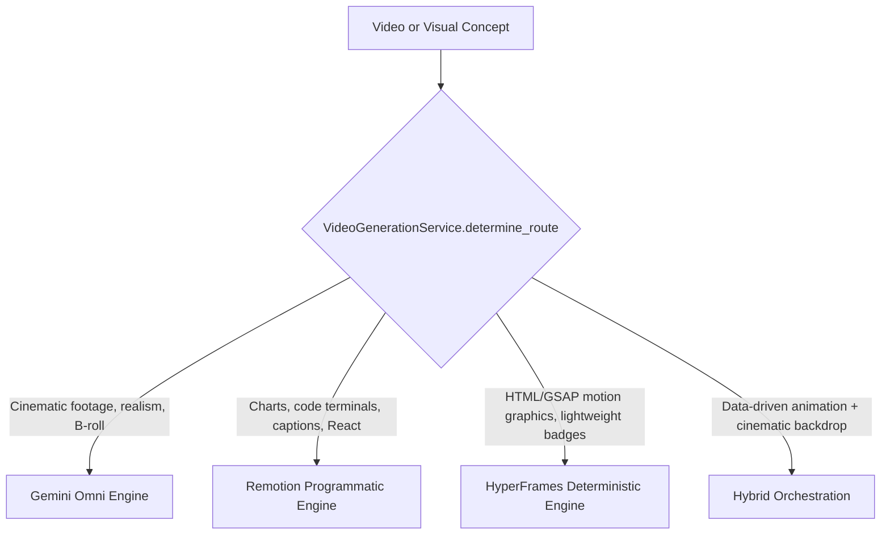

# AI Viral Radar V3 — Video Orchestrator & Prompt Lab

The **Video Orchestration Engine** (`backend/services/video/video_orchestrator.py`) provides intelligent routing and prompt generation across three specialized video engines: **Gemini Omni**, **Remotion**, and **HyperFrames**.

---

## 1. Engine Specialization & Dynamic Routing



| Engine | Best For | Core Technology |
| :--- | :--- | :--- |
| **Gemini Omni** | Photorealistic scenes, neural visuals, camera moves, B-roll | Multimodal generative video (20-field cinematic prompt) |
| **Remotion** | Benchmark bar charts, code terminals, animated captions | React, TypeScript, server-side headless Chrome rendering |
| **HyperFrames** | Dynamic headline badges, HUD telemetry, glassmorphic cards | HTML5, CSS3, deterministic frame-accurate GSAP timelines |

---

## 2. Gemini Omni 20-Field Cinematic Prompt Compiler

To prevent vague, generic prompts (e.g. *"Make a cool AI video"*), the compiler generates a structured, production-grade 20-field prompt payload:
1. `subject`: Precise physical focal point (e.g., *Sparse optical neural processing node*)
2. `action`: Micro-mechanical movements and optical data flow
3. `environment`: High-tech subterranean datacenter with clean industrial aesthetic
4. `time_of_day`: Studio-calibrated dark setting
5. `lighting`: 3200K diffused key with cyan edge illumination
6. `camera_shot`: Medium close-up transitioning to macro detail
7. `camera_lens`: 35mm anamorphic prime lens (f/1.8)
8. `camera_movement`: Slow, steady dolly push-in along optical axis
9. `composition`: Rule-of-thirds, vertical 9:16 framing
10. `depth_of_field`: Shallow depth with background bokeh
11. `materials`: Matte brushed aluminum, tempered glass, copper traces
12. `physics`: Accurate light transmission and fluid cooling refraction
13. `motion_fluidity`: Smooth 60fps mechanical fluidity without blur artifacts
14. `audio_ambience`: Low sub-bass hum with delicate electronic static pulses
15. `dialogue_space`: Empty (tailored for voiceover ducking)
16. `style_preset`: Cinematic Tech News
17. `color_tone`: Cybernetic slate, electric cyan, clean white
18. `continuity_contract`: Anchor node coordinates remain fixed across clip
19. `negative_constraints`: No watermarks, no distorted faces, no CGI cartoon shaders
20. `output_format`: 4K 60fps Vertical 9:16 HDR ProRes

---

## 3. Remotion Programmatic React Composition

The Remotion compiler generates a fully structured React composition configuration:
- `composition_name`: `Explainer_TopicName`
- `fps`: 30, `duration_in_frames`: 900 (30 seconds)
- `components`: `["TitleHookCard", "AnimatedMetricCounter", "SideBySideBarChart", "CodeTerminalDisplay", "AnimatedCaptions", "CallToActionBanner"]`
- `render_command`: Ready-to-execute CLI render invocation:
  ```bash
  npx remotion render src/index.ts Explainer_TopicName out/Explainer_TopicName.mp4 --props='{...}'
  ```

---

## 4. HyperFrames Deterministic HTML/GSAP Engine

HyperFrames requires frame-accurate, deterministic animation behavior. The compiler outputs:
- HTML markup with explicit `data-start` and `data-duration` attributes.
- Paused GSAP timeline code bound to frame-by-frame seeking:
  ```javascript
  const tl = gsap.timeline({ paused: true });
  tl.from(".badge", { scale: 0, opacity: 0, ease: "back.out(1.7)", duration: 0.5 }, 0.1)
    .from(".headline", { y: 60, opacity: 0, ease: "power3.out", duration: 0.8 }, 0.3)
    .from(".metric-card", { y: 120, opacity: 0, ease: "power4.out", duration: 1.0 }, 0.6);
  window.renderFrame = (timeInSeconds) => tl.seek(timeInSeconds);
  ```

---

## 5. 6-Scene Storyboard Architecture

Each video storyboard structure consists of 6 precisely timed beats:
1. `00:00 - 00:02` (**Hook Beat**): Instant pattern interrupt and bold claim
2. `00:02 - 00:05` (**Context Beat**): What changed and historical baseline
3. `00:05 - 00:09` (**Data Drop Beat**): Verified benchmark leap (Remotion / HyperFrames)
4. `00:09 - 00:15` (**Visual Explanation Beat**): 3D architectural breakdown (Gemini Omni)
5. `00:15 - 00:25` (**Implication & Caveat Beat**): Developer/business impact + counterpoint
6. `00:25 - 00:30` (**CTA Beat**): Actionable conversion end-card
