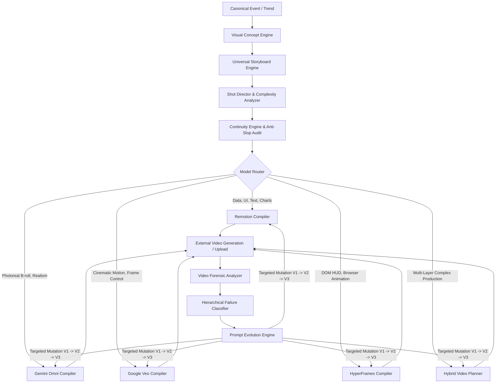

# AI Viral Radar V3.3: Universal Video Prompt Intelligence & Video Reality Benchmark

## 1. Overview & Core Philosophy

The role of the video subsystem in **AI Viral Radar V3.3** is an **AI Video Creative Director, Reality Benchmark, and Prompt Evolution Engine**.

Rather than stopping at valid prompt syntax, V3.3 closes the loop between **specification intent** and **actual video output**. It compiles executable, production-grade technical briefs for:
1. **Remotion Coding Agents** (React/TypeScript deterministic motion graphics, charts, and captions).
2. **Gemini Omni Flash** (Photorealistic cinematography, complex lighting, atmospheric depth, and multi-modal narrative B-roll).
3. **Google Veo** (High-fidelity cinematic physics, native audio, dialogue, and first/last frame visual transformations).
4. **HyperFrames** (Seekable DOM/CSS compositions driven deterministically by paused GSAP timelines).
5. **Hybrid Assembly Pipelines** (Unified timeline integrating generative video, vector graphics, animated captions, and multi-track audio).
6. **Video Reality Benchmark & Forensics** (Audits actual video files across 23 forensic dimensions, generates keyframes 0%–100%, and detects failures).
7. **Prompt Evolution Engine** (Mutates defective prompt sections based on empirical failures while preserving validated creative elements).

---

## 2. Architecture & Pipeline



### End-to-End Workflow:
```
EVENT -> STORY -> VISUAL CONCEPT -> SHOT DESIGN -> ASSET STRATEGY -> MODEL ROUTING -> PROMPT -> GENERATION -> FORENSIC ANALYSIS -> FAILURE DETECTION -> PROMPT REVISION -> RE-GENERATION -> FINAL QUALITY GATE
```

---

## 3. Model Capability Registry & Routing Rules

The capability registry (`backend/services/video/model_capabilities.py`) enforces strict physical and architectural boundaries:

| Engine | Primary Strengths | Supported Features | Critical Limitations (Rejected Operations) |
| :--- | :--- | :--- | :--- |
| **Remotion** | Benchmark graphs, timelines, animated typography, UI code, metric cards, parameterized props | `useCurrentFrame`, `interpolate`, `spring`, `Sequence`, `calculateMetadata`, `TransitionSeries` | Cannot synthesize photorealistic real-world human skin, volumetric mist, or organic fluid physics |
| **Gemini Omni Flash** | Photorealistic cinematic B-roll, research labs, atmospheric depth, 35mm anamorphic optics | Natural lighting, shallow DoF, multi-modal reference, audio ambience | Cannot render pixel-perfect typography, exact charts, or deterministic millisecond data |
| **Google Veo** | Cinematic physics, start/end keyframe transitions, native dialogue, camera control | First/Last frame interpolation, image-to-video motion, native audio | Cannot execute DOM/React rendering or generate SVG vector code |
| **HyperFrames** | DOM telemetry, terminal displays, HUD overlays, high-speed metric counters | Pure HTML5, CSS layout, paused GSAP timelines (`window.__timelines`) | No wall-clock animations (`setTimeout`, `setInterval`, `requestAnimationFrame`, `Date.now()`) |

---

## 4. Universal Storyboard Engine (`storyboard_engine.py`)

### Multi-Shot Precision by Platform:
- **Instagram Reel (30s)**: 7 to 10 rapid pattern-interrupt shots (9:16 vertical composition).
- **YouTube Short (60s)**: 6 structured retention-arc shots (hook, escalating context, core proof, practical demo, takeaway, CTA).
- **YouTube Long Form (180s+)**: 12 to 16 multi-scene shots divided across chapters (Cold Open, Technical Deep Dive, Micro Architecture, Benchmarks, Production Tradeoffs, Final Conclusion).
- **X / Twitter (15–45s)**: High cognitive density, immediate source cards, and concise punchline.

### 3-Hook Visualizer:
Every concept dynamically generates three competing hooks:
1. **Hook A (Provocative Question / Cognitive Tension)**
2. **Hook B (Empirical Data Disruption / Surprising Metric)**
3. **Hook C (Story Anchor / Insider Engineering Narrative)**
Each hook specifies:
- First spoken line
- First visual frame
- First camera move
- First text overlay
- Sound design / SFX impact
- Curiosity mechanism & cognitive tension score

### Character Bible & Visual Metaphors:
- If a video features characters, a structured **Character Bible** specifies name, role, visual attire, physical features, lighting palette, and facial reference sheet assets to guarantee cross-shot continuity.
- Visual metaphors (e.g., massive mechanical flywheel accelerating for compute scaling) are tagged internally as `METAPHORICAL_VISUAL` so viewers never mistake symbolic visualizations for literal documentary footage.
- Genuine benchmark numbers or paper figures are tagged as `LITERAL_DOCUMENTARY` with verified source attribution cards.

---

## 5. Remotion Prompt Compiler (`remotion_prompt_compiler.py`)

Produces a complete standalone implementation brief for an AI coding agent:
- **Primitives**: Instructs the agent precisely when to employ `useCurrentFrame()`, `useVideoConfig()`, `interpolate()`, `spring()`, `Sequence`, `Series`, `TransitionSeries`, `OffthreadVideo`, `staticFile()`, and `calculateMetadata()`.
- **Parametric Data Contract**: Defines full TypeScript `interface VideoProps` for dynamic data feeding.
- **Micro-Animation Specs**: Declares start frame, end frame, initial/final CSS values, spring physics (`damping`, `stiffness`, `mass`), or deterministic interpolation arrays with easing curves.
- **Anti-Fluff Rules**: Explicitly prohibits generic AI motion graphics, floating neon shapes, arbitrary particles, unmotivated zooms, and unreadable fonts.
- **Asset Manifest**: Full manifest detailing SVGs, terminal commands, benchmark JSON arrays, audio stems, and B-roll clips.

---

## 6. Gemini Omni Flash Prompt Compiler (`omni_prompt_compiler.py`)

Generates shot-by-shot cinematic production prompts:
- **Optical Lens & Rig**: 35mm anamorphic prime lenses, f/1.8 aperture, controlled dolly/jib moves, 2.39:1 / 9:16 framing.
- **Lighting & Atmosphere**: Diffused key lights, cyan/indigo edge separation, volumetric haze, physical reflections.
- **Continuity Constraints**: Explicit preservation of subject faces, clothing, environment landmarks, and color grading.
- **Negative Constraints**: Rejects low-poly geometry, random flashing, unmotivated camera whip pans, deformed hands, and floating UI elements outside physical screens.

---

## 7. Google Veo Prompt Compiler (`veo_prompt_compiler.py`)

Implements Google's 6-part cinematography principles:
```
Cinematography + Subject + Action + Context + Style/Ambience + Audio
```
- **First/Last Frame Workflow**: When visual transformation is required, compiles:
  1. *Start Frame Prompt* (Static high-fidelity state).
  2. *End Frame Prompt* (Static transformed state).
  3. *Transition Motion Prompt* (Continuous camera/subject motion without intermediate hallucination).
- **Image-to-Video Workflow**: Declares immutable anchor elements vs moving dynamic elements.

---

## 8. HyperFrames Prompt Compiler (`hyperframes_prompt_compiler.py`)

Generates seekable, frame-deterministic web motion graphics:
- **DOM Markup**: Clean semantic HTML tree (`.hyperframe-container`, `.terminal-window`, `.metric-badge`).
- **Scoped CSS**: Glassmorphism surfaces, typography hierarchy (`Inter`, `JetBrains Mono`), subtle glow orbs.
- **Deterministic GSAP**:
  - `gsap.timeline({ paused: true })` registered on `window.__timelines[comp_id]`.
  - Absolute timeline positions (no relative chaining).
  - Headless frame-by-frame renderer compatibility (`window.renderFrame(timeSec)`).
  - Strict ban on `setTimeout`, `setInterval`, `requestAnimationFrame`, `Date.now()`, and unseeded `Math.random()`.

---

## 9. Hybrid Video Planner (`hybrid_planner.py`)

Combines multiple generation engines into a single master production timeline:
- **Multi-Engine Shot Table**: Explicit engine assignment per shot (Omni for live-action B-roll, Remotion for data charts, HyperFrames for HUD).
- **Layer Compositing Guide**:
  - `Layer 0`: Gemini Omni Photoreal Base Footage
  - `Layer 1`: Remotion Motion Graphics & Vector SVG
  - `Layer 2`: Remotion Synchronized Captions
  - `Layer 3`: Master Dynamic Audio
- **Audio Ducking Matrix**: -16dB music attenuation during voiceover, +3dB SFX boost during numeric reveals.

---

## 10. 15-Dimension Quality Gate (`video_quality_evaluator.py`)

Every prompt package is evaluated across 15 criteria scored 0–100 (Pass threshold $\ge 85.0$):
1. **Narrative Clarity**: Coherent beginning, escalation, and resolution.
2. **Visual Specificity**: Concrete physical surfaces, materials, and lighting.
3. **Shot Specificity**: Explicit camera angles, focal lengths, and framing.
4. **Camera Specificity**: Defined direction, speed, and axis of camera movement.
5. **Motion Specificity**: Unambiguous subject actions without conflicting verbs.
6. **Continuity Constraints**: Consistent characters, props, and environments.
7. **Asset Completeness**: All required SVGs, audio cues, and footage accounted for.
8. **Audio Completeness**: Detailed voiceover, music BPM, and timecoded SFX cues.
9. **Platform Fit**: Aspect ratio, pacing, and safe-zone compliance.
10. **Technical Executability**: Target engine capability compliance.
11. **Originality**: Absence of repetitive stock motifs.
12. **Factual Integrity**: Visual claims grounded in verified canonical events.
13. **Temporal Consistency**: Shot durations match total runtime.
14. **Visual Variety**: Alternating scales (wide, medium, extreme close-up).
15. **Production Readiness**: Copy-ready instructions without placeholder brackets.

### Automatic Fluff Detection:
Any prompt using vague buzzwords (*"make it cinematic"*, *"make it viral"*, *"add cool animations"*, *"use dynamic visuals"*) is **instantly penalized or rejected** unless accompanied by concrete physical parameters.

---

## 11. Reusable Templates & Prompt Memory (`prompt_memory.py`)

Houses **19 production templates** across major video genres:
1. Cinematic Documentary
2. Breaking News
3. AI Product Launch
4. AI Research Explainer
5. Technical Deep Dive
6. Benchmark Breakdown
7. Founder Story
8. Future Scenario
9. Cybersecurity Incident
10. Model Comparison
11. Before/After
12. Timeline
13. Data Story
14. Explainer
15. Character Story
16. Conversation
17. Product Advertisement
18. Educational Short
19. YouTube Documentary

Tracks creator ratings, quality scores, and failure modes to calibrate future tone and camera language.

---

## 12. Export & 1-Click Copy Formats

The system exports 7 production formats via the UI and `/api/video/export`:
- `video_package.json`: Complete machine-readable Pydantic package.
- `video_storyboard.md`: Human-readable director's storyboard.
- `shot_list.md`: Master production shot list table.
- `remotion_prompt.md`: Standalone coding agent instruction for Remotion.
- `omni_prompts.md`: Multi-shot Gemini Omni production prompts.
- `veo_prompts.md`: Google Veo cinematography prompts with keyframe workflows.
- `hyperframes_prompt.md`: HyperFrames deterministic DOM + GSAP specification.
